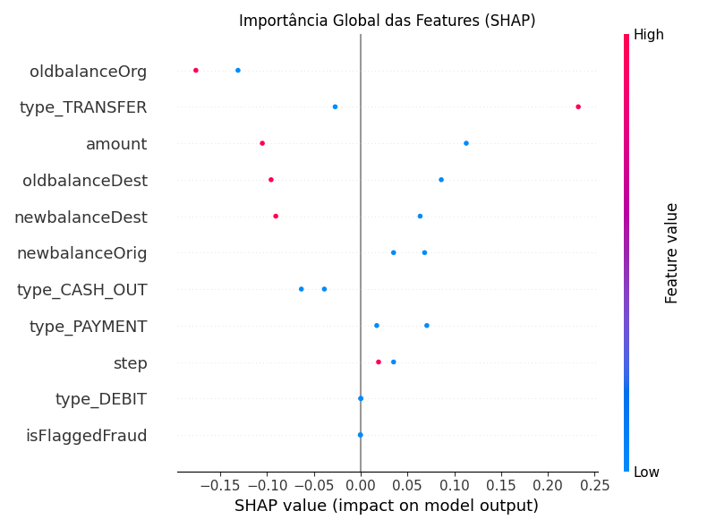
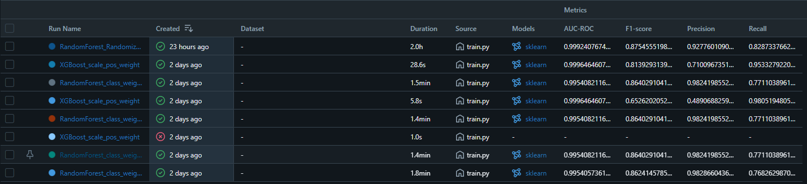

# Detecção de Fraudes em Transações Financeiras

Projeto completo de machine learning para detecção de fraudes em transações financeiras, com pipeline de pré-processamento, treinamento, inferência, explicabilidade (SHAP) e rastreabilidade de experimentos via MLflow.

## Sumário
- Visão Geral
- Estrutura do Projeto
- Como Rodar o Projeto
- Ambiente e Dependências
- Pré-processamento dos Dados
- Treinamento do Modelo
- Inferência e Explicabilidade
- Resultados
- Explicabilidade com SHAP
- Reprodutibilidade e MLflow

---

## Visão Geral

Este projeto implementa um pipeline de detecção de fraudes em transações financeiras, utilizando Random Forest otimizado e explicabilidade com SHAP. O objetivo é identificar transações suspeitas com alta precisão e recall, fornecendo também transparência sobre as decisões do modelo.

---

## Estrutura do Projeto

```
fraude-deteccao/
├── data/                # Dados brutos e processados
│   ├── aimldataset.csv
│   └── aimldataset_processed.csv
├── models/              # Scaler salvo para inferência
│   └── scaler.joblib
├── src/                 # Scripts principais
│   ├── data_preprocessing.py
│   ├── train.py
│   └── inference.py
├── visualizations/      # Gráficos e resultados do modelo treinado
│   ├── confusion_matrix.txt
│   ├── shap_force_plot_transacao1.png
│   ├── shap_force_plot_transacao2.png
│   └── shap_summary_plot.png
├── requirements.txt     # Dependências do projeto
└── README.md  
```

---

## Como Rodar o Projeto

### Dados

Os arquivos de dados não são versionados neste repositório devido ao tamanho.  
Faça o download do dataset público diretamente do Kaggle:

- [Kaggle: Fraud Detection Dataset](https://www.kaggle.com/datasets/amanalisiddiqui/fraud-detection-dataset)

Após o download, coloque o arquivo `AIML Dataset.csv` (ou renomeie para `aimldataset.csv`) na pasta `data/`.

Então, gere o dataset processado rodando:

```bash
python src/data_preprocessing.py
```

### 1. Ambiente e Dependências

Recomenda-se o uso de um ambiente virtual (conda ou venv).

```bash
conda create -n fraude python=3.10
conda activate fraude
pip install -r requirements.txt
```

### 2. Pré-processamento dos Dados

Gera o dataset processado e salva o scaler para uso posterior.

```bash
python src/data_preprocessing.py
```

### 3. Treinamento do Modelo

```bash
python src/train.py
```

### 4. Inferência e Explicabilidade

```bash
python src/inference.py
```

---

## 📊 Resultados e Interpretação

- **Matriz de Confusão**: visualizations/confusion_matrix.txt
- **Gráficos SHAP**: 
  - visualizations/shap_force_plot_transacao1.png
  - visualizations/shap_force_plot_transacao2.png
  - visualizations/shap_summary_plot.png

Exemplo de matriz de confusão obtida:
```
[[1906163    159]
 [   422    2042]]
```

Principais métricas do modelo:
- **AUC-ROC**: 0.999
- **Precision**: 0.928
- **Recall**: 0.829
- **F1-score**: 0.875

### 📌 Resumo da análise

| Feature           | Impacto   | Interpretação                                             |
|-------------------|-----------|-----------------------------------------------------------|
| type_TRANSFER     | Alto      | Transações TRANSFER aumentam chance de fraude             |
| oldbalanceOrg     | Alto      | Saldos baixos do remetente aumentam risco                 |
| amount            | Moderado  | Transações de valor alto são mais suspeitas               |
| oldbalanceDest    | Moderado  | Destinatários com saldo anterior alto → menor risco       |
| newbalanceOrig    | Médio     | Saldos finais baixos do remetente podem indicar fraude    |
| type_CASH_OUT     | Leve      | Levemente associado a risco quando presente               |

---

## Explicabilidade com SHAP

Os gráficos SHAP mostram como cada feature contribuiu para a decisão do modelo em cada transação e a importância global das features.

Exemplo de gráfico SHAP:



---

## Reprodutibilidade e MLflow

Todos os experimentos de treino são rastreados via MLflow **localmente**.

> **Atenção:** Por padrão, a pasta `mlruns/` não é versionada neste repositório.  
> Portanto, ao rodar `mlflow ui`, você verá apenas os experimentos que executar localmente.

Para visualizar o histórico de runs e comparar modelos após rodar seus próprios experimentos:

```bash
mlflow ui
```
Acesse [http://localhost:5000](http://localhost:5000) no navegador.

Meu track:

